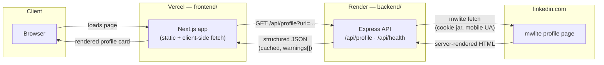

# LinkedIn Profile API

Give it a LinkedIn profile URL, get structured JSON back.

```
GET /api/profile?url=https://www.linkedin.com/in/williamhgates
```

```json
{
  "success": true,
  "meta": { "source": "linkedin", "cached": false, "fetchedAt": "…", "durationMs": 2186 },
  "data": {
    "fullName": "Bill Gates",
    "headline": "Co-chair, Gates Foundation",
    "location": { "full": "Seattle, Washington, United States", "country": "United States" },
    "followersCount": 40604081,
    "summary": "…",
    "profilePicture": { "original": "https://media.licdn.com/…", "sizes": [ … ] },
    "experience": [ … ], "education": [ … ], "skills": [ … ],
    "certifications": [ … ], "languages": [ … ]
  }
}
```

`backend/` — the API. Node.js 20+, TypeScript, Express.
`frontend/` — a small Next.js + Tailwind page to try it in a browser.

This is a second iteration on the same brief (see [`git log`] for the first one, a Python/FastAPI service built around LinkedIn's classic Voyager REST API). That approach worked for its one endpoint that's still alive, but its five optional per-section endpoints (positions, educations, skills, certifications, languages) were confirmed dead — a consistent `302` self-redirect against a live, authenticated session, tested twice in isolation. This version starts over around a different transport that doesn't have that gap: LinkedIn's `mwlite` mobile site.

## Why mwlite

Ask `linkedin.com/in/<slug>` for a page and what comes back depends on how you present yourself:

| You look like | What LinkedIn sends | Useful? |
|---|---|---|
| a logged-out visitor | a teaser page + Open Graph tags | the profile photo, nothing else |
| a desktop browser | a large React-Server-Components-style stream, server-rendered inline | data is there, but as UI-tree fragments, not a data model |
| a phone browser | `mwlite`: the whole profile as plain, semantic HTML | yes |

The desktop finding lines up with what the previous iteration found from the browser side: LinkedIn's modern desktop profile page ships its data embedded in the initial HTML via a proprietary streaming payload, not via a separate REST or GraphQL call a script could call directly. `mwlite` is a different, older rendering path built for slow connections — the server does all the work and ships finished HTML: name, headline, location, about, experience, education, skills, certifications, languages, projects, logos, one request, no JavaScript required to read it.

So the client sends a phone user-agent and reads the HTML that comes back. See `backend/src/linkedin/client.ts`.

### The two things that make it work

1. **The whole cookie header.** `li_at` alone isn't enough — LinkedIn also checks its routing and device cookies (`lidc`, `bcookie`, `bscookie`). Miss them and a request is more likely to be treated as a replayed cookie. A real browser sends a few dozen cookies; this client forwards the same set it was given.
2. **A cookie jar.** LinkedIn can respond to a request with a redirect that also carries a *replacement* `li_at` via `Set-Cookie`, expecting the retry to use it. A client that keeps resending the original loops on that redirect forever. `client.ts` stores whatever LinkedIn hands back and retries with it (bounded to 4 hops, so a genuine dead session still fails cleanly instead of looping).

### Reading the HTML without it being fragile

`backend/src/linkedin/parse.ts` leans on the things that don't change as often as CSS:

- LinkedIn's own tracking attributes (`data-tracking-control-name="profile-position"`) mark meaning, not styling.
- Semantic container classes (`.experience-container`, `.skills-list`, …) over anything that looks like a generated utility class.
- Shape, not position — inside an entry, "which line looks like a date" (contains a year or "Present") rather than assuming a fixed line order.

Three quirks are handled explicitly:

| Quirk | What you'd see | What's done about it |
|---|---|---|
| Separators are drawn in CSS | `<span class="dot-separator">` is empty text, so "Master of Science · Computer Science" would arrive as one run-on string | replace those spans with a literal `·` up front, then split on it |
| Images are lazy-loaded | the real URL is in `data-delayed-url`; `src` is a grey placeholder on `static.licdn.com` | only accept `media.licdn.com` URLs |
| Location shares its element with follower/connection counts | `"Seattle, Washington 40,604,066 followers"` | pull the counts out by pattern, keep the remainder |

**Honesty note:** verified 2026-08-29 against one profile captured live through this project's own throwaway account. Most of the original guesses held up (`.experience-container`, `.education-container`, `.skills-list`, `.summary-container`, `.dot-separator`, tracking attributes, lazy images); the topcard name/headline/location selectors and the experience/education item structure didn't and were corrected — see `parse.ts`'s module docstring and `git log` for exactly what changed and why. One real bug the capture caught: the page embeds the *viewer's* own nav-bar avatar before the subject's photo, so a naive "first profile-shaped image" selector would have silently returned the wrong person's photo — `avatar` is now scoped to the alt-text pattern that's unique to the subject. Certifications/languages/projects/etc. weren't present on the one profile captured, so those selectors are still unconfirmed guesses rather than invented facts. `MOCK_MODE`'s fixture was updated to match the confirmed real structure.

### Where the profile photo comes from

`mwlite` doesn't reliably ship a member's avatar inline. When the mwlite parse comes back with no photo, a second, unauthenticated request goes to the logged-out public page and reads its `og:image` tag. That request needs no cookie, can't accidentally pick up the viewer's own avatar, and is allowed to fail without failing the whole lookup — see `fetchPublicOgImage` in `client.ts`.

## What this does NOT do

No CAPTCHA bypass. No TLS fingerprint impersonation. No proxy rotation. No login automation. A phone user-agent asking for the mobile version of a public page is normal client behavior — the same category as a responsive site serving different markup to different devices — not an evasion technique, and the client stops there. If LinkedIn redirects to a login or checkpoint wall, it's surfaced as a clear error; nothing tries to solve it.

## Live deployment

| | URL |
|---|---|
| Frontend | [frontend-teal-omega-81.vercel.app](https://frontend-teal-omega-81.vercel.app/) |
| Backend API | [project-x-z8lf.onrender.com](https://project-x-z8lf.onrender.com) (health: `/api/health`) |

**Keeping the backend awake:** the backend runs on Render's free tier, which sleeps after 15 minutes of inactivity -- the first request after a quiet spell takes ~50s while the instance wakes (the frontend's error message already accounts for this, see `page.tsx`). Render's own scheduling can't ping more often than hourly, which wouldn't be enough to outrun a 15-minute sleep window, so an external uptime-monitoring service (e.g. [cron-job.org](https://cron-job.org) or [UptimeRobot](https://uptimerobot.com)) pings `/api/health` every 5-10 minutes to keep the instance warm. This is a free-tier workaround, not a guarantee -- the honest fix is upgrading to a paid Render plan, which doesn't sleep on idle at all.

## Architecture



The backend never exposes the LinkedIn cookie to the frontend or the browser -- `NEXT_PUBLIC_API_BASE_URL` is the only thing the frontend knows about the backend, and the frontend calls it directly (no server-side proxy hop), so the backend's own per-IP rate limit and CORS allowlist are what stand between the public internet and LinkedIn.

### Backend request flow

```
caller
  │  GET /api/profile?url=...  (+ optional x-api-key)
  ▼
Express route  ── per-IP token-bucket limiter (express-rate-limit), API key check
  │
  ▼
TtlCache (stale-while-revalidate, single-flight per key)
  │  hit (fresh)  → return immediately
  │  hit (stale)  → return immediately, refresh in background
  │  miss         → block on:
  ▼
ProfileService
  │
  ├─▶ CircuitBreaker.beforeCall()      ── stop calling LinkedIn after N
  │                                        consecutive auth-shaped failures
  ├─▶ TokenBucket.acquire()            ── pace outbound calls; see
  │                                        "A live-observed finding" below
  ├─▶ LinkedInClient.fetchProfileHtml() ── mwlite fetch, full cookie header,
  │                                         cookie jar, bounded redirect retry
  └─▶ parseMwliteHtml()                ── HTML -> our schema, cheerio
  │
  ▼
ProfileResponse + warnings[] + cached:bool
```

## A live-observed finding this design is built around

While validating the previous (Python/Voyager) iteration against a real account, calls landing back-to-back with no spacing — even to an endpoint that worked cleanly on its own — repeatedly triggered a server-side session kill (silent logout, auto-relogin, no CAPTCHA). It happened three separate times, always right after a prior call, never in isolation. That's not a Voyager-specific quirk; it's evidence about how this account's session is monitored, and it applies here too. `LINKEDIN_MIN_INTERVAL_MS` (default 1200ms) and `LINKEDIN_BURST` (default 2) exist specifically because of that, not as generic good manners — treat lowering them as something to re-verify live, not just a config tweak.

## Quick start

Requirements: Node.js 20+.

### Backend

```bash
cd backend
npm install
cp .env.example .env
npm run dev
```

`.env.example` ships with `MOCK_MODE=true`, so it runs immediately with no LinkedIn account — it serves a bundled synthetic profile through the exact same parsing pipeline.

```bash
curl "http://localhost:4000/api/profile?url=https://www.linkedin.com/in/ada-lovelace"
```

For real profiles, put your cookie in `.env` (see below) and set `MOCK_MODE=false`.

### Frontend

```bash
cd frontend
npm install
cp .env.example .env.local
npm run dev
```

Open `http://localhost:3000`, paste a profile URL. The page calls the backend directly — there's no server-side hop, so the backend's per-IP rate limit applies per visitor, not per frontend deployment.

## Getting your LinkedIn cookie

The backend authenticates as you, using cookies from a browser where you're already signed in. No password is typed or stored by this code.

1. Sign in to `linkedin.com` in Chrome, **on a throwaway account** — not your main one. Scraping with your own session violates LinkedIn's User Agreement regardless of the data's public status, and the realistic consequence of getting caught is a restricted account.
2. Open any profile. DevTools (F12) → Network → filter to Doc → hard-reload.
3. Click the one row named after the profile → Headers → Request Headers → right-click `cookie:` → Copy value.
4. Paste into `backend/.env`:
   ```
   LINKEDIN_COOKIE='li_at=AQED...; JSESSIONID="ajax:..."; bcookie="v=2&..."; bscookie="v=1&..."; lidc="b=..."'
   MOCK_MODE=false
   ```

Treat this like a password — anyone holding it is logged in as you. `.env`, `capture*.txt`, and `*.har` are all git-ignored. Cookies expire and rotate; when that happens the API returns a clear `LINKEDIN_ERROR` rather than failing silently or trying to log back in on its own.

## Environment variables

| Variable | Default | What it does |
|---|---|---|
| `LINKEDIN_COOKIE` | — | Full cookie header. Required unless `MOCK_MODE=true`. |
| `LINKEDIN_LI_AT` / `LINKEDIN_JSESSIONID` | — | Older two-cookie fallback. Usually not sufficient alone. |
| `MOCK_MODE` | `false` | Serve the bundled synthetic profile instead of calling LinkedIn. |
| `PORT` | `4000` | Port to listen on. |
| `API_KEY` | (empty) | If set, callers must send it as `x-api-key`. Empty = open API. |
| `CORS_ORIGINS` | `*` | Comma-separated allowed browser origins. |
| `CACHE_TTL_SECONDS` / `CACHE_STALE_SECONDS` | `900` / `3600` | Fresh / stale-but-servable cache lifetimes. |
| `RATE_LIMIT_WINDOW_MS` / `RATE_LIMIT_MAX` | `60000` / `20` | This API's own per-IP limit. |
| `LINKEDIN_MIN_INTERVAL_MS` / `LINKEDIN_BURST` | `1200` / `2` | Outbound pacing to LinkedIn — see "A live-observed finding" above. |
| `CIRCUIT_BREAKER_FAILURE_THRESHOLD` / `_RESET_SECONDS` | `3` / `30` | Stop calling LinkedIn after N consecutive auth-shaped failures. |
| `REQUEST_TIMEOUT_MS` | `10000` | Per-call timeout. |
| `LOG_LEVEL` | `info` | pino log level. |

Invalid configuration fails at startup (zod-validated), not at the first request.

## API documentation

Authentication: if `API_KEY` is set, send it as `x-api-key: <key>` or `Authorization: Bearer <key>`. Otherwise no auth needed. Compared in constant time.

### `GET /api/health`

Never requires an API key.

```json
{ "success": true, "status": "ok", "uptimeSeconds": 42, "mode": "live", "linkedInCredentialsConfigured": true, "version": "2.0.0" }
```

### `GET /api/profile` / `POST /api/profile`

| Param | Type | Default | Description |
|---|---|---|---|
| `url` | string | required | A LinkedIn profile URL, or a bare slug. Max 500 chars. |
| `refresh` | true/false | false | Skip the cache read; still writes the fresh result back. |

Accepted URL shapes: full `/in/<slug>` URLs on any subdomain, with any query string, with a trailing sub-path (`/details/experience/`), percent-encoded names, or a bare slug.

```bash
curl -G http://localhost:4000/api/profile --data-urlencode "url=https://www.linkedin.com/in/williamhgates"
```

### Errors

Every failure uses the same envelope: `{ "success": false, "error": { "code", "message", "requestId" } }`.

| HTTP | code | Cause |
|---|---|---|
| 400 | `BAD_REQUEST` | Missing, malformed, or not a `/in/` profile URL. |
| 401 | `UNAUTHORIZED` | `API_KEY` set and missing/wrong. |
| 404 | `PROFILE_NOT_FOUND` | No such profile, or not visible to the logged-in account. |
| 404 | `ROUTE_NOT_FOUND` | No such endpoint. |
| 429 | `RATE_LIMITED` | You hit this API's per-IP limit. |
| 429 | `LINKEDIN_RATE_LIMITED` | LinkedIn is throttling this account. |
| 502 | `LINKEDIN_ERROR` | Cookie stale/incomplete, login wall, redirect loop, or a security challenge. |
| 503 | `NOT_CONFIGURED` | No cookie set and `MOCK_MODE` is off. |
| 503 | `UPSTREAM_UNAVAILABLE` | Circuit breaker open after repeated auth-shaped failures. |
| 504 | `UPSTREAM_TIMEOUT` | LinkedIn didn't respond within `REQUEST_TIMEOUT_MS`. |

## Response schema

Rules followed throughout: a missing single value is `null`, never `undefined`/`""`. A missing list is `[]`. Dates are structured *and* pre-formatted (`{ month, year, text }`) so a caller can compute or just print without writing a formatter. Images come as a set of sizes plus `original`.

Two honesty notes:

- `dateRange.text` reuses LinkedIn's own wording for a duration rather than recomputing it, so this API never disagrees with what the site says.
- `profileId` is always `null`. `mwlite` does embed a member URN, but it's the *viewer's*, byte-identical across different people's profiles — a confident wrong id is worse than an honest empty one.

Full type definitions: `backend/src/types/profile.ts`.

## Project layout

```
backend/
  fixtures/profile.html        synthetic mwlite page (powers MOCK_MODE + tests)
  src/
    index.ts                   bootstrap, graceful shutdown
    app.ts                     express app: helmet, cors, rate limit, routes
    config/env.ts               zod-validated environment, fails fast
    routes/{health,profile}.ts
    middleware/{auth,errorHandler}.ts
    linkedin/
      url.ts                    profile URL -> public identifier
      client.ts                 mwlite fetch: full cookie header + cookie jar
      parse.ts                  mwlite HTML -> our schema
      service.ts                orchestration: breaker -> pacing -> cache -> fetch -> parse
    utils/                      circuitBreaker, tokenBucket, ttlCache, logger, apiError
    types/profile.ts            the public response schema
    __tests__/                  36 tests: url parsing, HTML parsing, HTTP API, architecture guard

frontend/
  src/app/page.tsx              the search page
  src/components/ProfileView.tsx
  src/lib/types.ts               a copy of the response schema
```

## Deploying

**Backend on Render** — `render.yaml` at the repo root is a ready blueprint (`dockerContext: ./backend`). `LINKEDIN_COOKIE`/`API_KEY` are `sync: false`, so they live in Render's dashboard, never in git. Health check: `GET /api/health`.

**Anywhere else** — `backend/Dockerfile` is multi-stage, non-root, production dependencies only:
```bash
cd backend
docker build -t linkedin-profile-api .
docker run -p 4000:4000 --env-file .env linkedin-profile-api
```

**Frontend on Vercel** — Root Directory `frontend`, one env var: `NEXT_PUBLIC_API_BASE_URL=https://your-api.example.com`. Then set the backend's `CORS_ORIGINS` to the Vercel domain.

## Testing

```bash
cd backend
npm test        # 36 tests: URL parsing, HTML parsing, HTTP API, architecture guard -- offline, no credentials
npm run typecheck
npm run build    # tsc compiles cleanly
```

## Security notes

The cookie only ever comes from the environment — never logged (pino redacts `cookie` and `x-api-key`), never returned in a response, never written to disk by this code. Input is validated before use: only `linkedin.com` hosts and `/in/` paths are accepted, the slug is rejected if it decodes to path-traversal syntax, and re-encoded before reaching LinkedIn. API keys compare in constant time. `capture*.txt`/`*.har` are git-ignored, since a copied cURL command or HAR export carries the whole cookie header.

## Known limitations

- **`parse.ts`'s core selectors are verified against one live capture** (name, headline, location, followers, summary, profile photo, experience, education, skills — see git history for the fix commit). Certifications/languages/projects/volunteering/honors/etc. were absent from that one profile, so those selectors remain unconfirmed guesses, not proven facts. Verifying against a profile that actually has them is the next concrete step.
- **Access is scoped to what the account sees.** Out-of-network profiles may come back sparse.
- **Cookies expire and rotate; there's no automatic refresh** — logging in programmatically is exactly what trips bot detection. When the cookie dies, the API says so plainly (`LINKEDIN_ERROR`).
- **One account, one throughput ceiling.** See "A live-observed finding" above — this isn't theoretical for this project.
- **`industry`, `countryCode`, `isPremium`, skill `endorsementCount` are always `null`** — not on the `mwlite` page.
- **Contact info is not fetched** — it's the most sensitive part of a profile and isn't required by the brief.
- **The cache, rate limiter, and circuit breaker are process-local**, same trade-off as the previous iteration. Horizontal scale means moving them to a shared store (Redis) — `TtlCache`'s interface was kept narrow for that reason.
- **`MOCK_MODE` data is synthetic** — it proves the pipeline, not that every real-world markup quirk is handled.
- **The identity check can still be silently bypassed, and this is an open gap, not a resolved one.** Live testing against the deployed backend found a real case: requesting one slug returned a different, unrelated real person's data, with only a soft warning, no rejection. A fix was added (`service.ts` now also checks the URL LinkedIn's response was actually served from, not just the HTML's own canonical/og:url tag) and it does catch a *redirect-based* substitution. It does **not** catch the case actually observed live: LinkedIn returning `200` at the exact URL requested, with a different profile's HTML, no redirect, and no canonical/og:url tag -- there is no header- or meta-tag-level signal left to check in that case. The remaining option is a content-based heuristic (e.g. comparing the requested slug against the parsed page's own name), deliberately not added yet: name-matching is fuzzy (nicknames, legal-name changes, transliteration) and a heuristic that's wrong in the other direction -- rejecting a real profile -- has its own cost. Until this is closed, treat any response for a slug you can't independently confirm as unverified, regardless of the `warnings[]` array being empty.

## Legal and ethical note

Scraping LinkedIn with your own session violates LinkedIn's User Agreement regardless of the data's public status under law — the realistic consequence is a restricted or banned account, hence the throwaway-account guidance above. Profile data is also personal data; in the EU/UK, GDPR applies whether or not it was public. For anything beyond evaluation, the honest answer is LinkedIn's official partner APIs or a licensed vendor — this project exists to show the mechanism is understood, not as a production scraping service.
